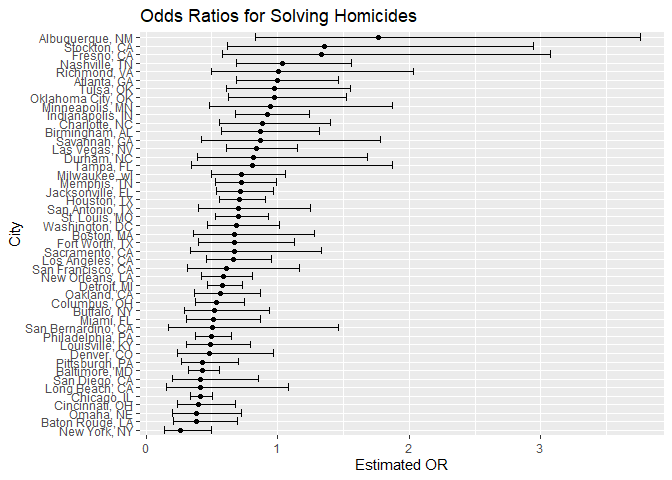
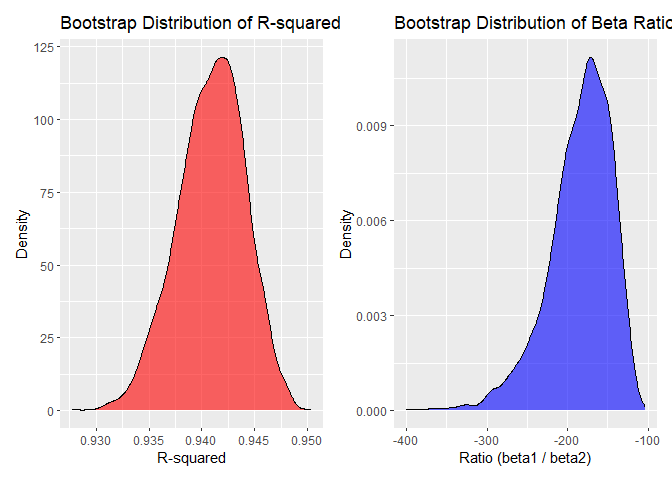
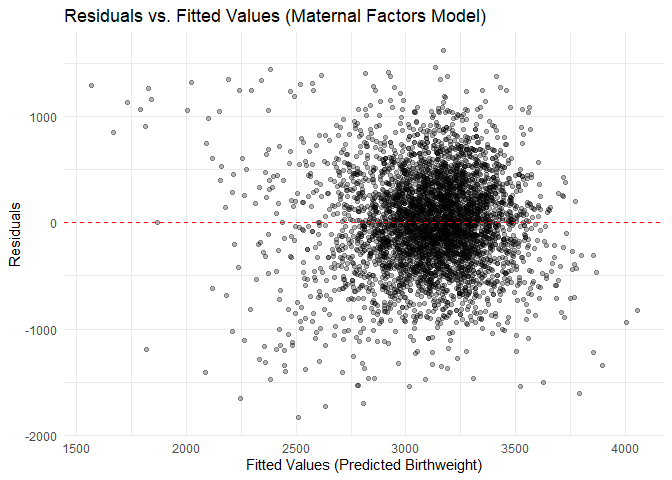
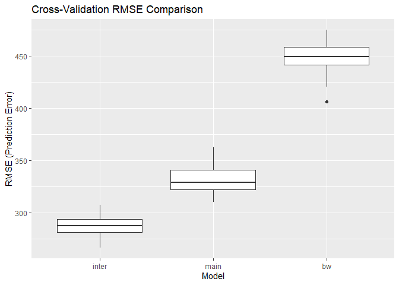

p8105_hw6_tl3391
================
Tong Liu
2025-12-02

## Problem 1

``` r
#import and clean the dataset
homicide_df = 
  read_csv("datasets/homicide-data.csv") |> 
  mutate(
    city_state = str_c(city, ", ", state),
    resolved = as.numeric(disposition == "Closed by arrest"),
    victim_age = as.numeric(victim_age)
  ) |> 
  filter(
    !city_state %in% c("Dallas, TX", "Phoenix, AZ", "Kansas City, MO", "Tulsa, AL"),
    victim_race %in% c("White", "Black")
  ) |> 
  select(city_state, resolved, victim_age, victim_sex, victim_race)
```

    ## Rows: 52179 Columns: 12
    ## ── Column specification ────────────────────────────────────────────────────────
    ## Delimiter: ","
    ## chr (9): uid, victim_last, victim_first, victim_race, victim_age, victim_sex...
    ## dbl (3): reported_date, lat, lon
    ## 
    ## ℹ Use `spec()` to retrieve the full column specification for this data.
    ## ℹ Specify the column types or set `show_col_types = FALSE` to quiet this message.

``` r
# logistic regression for Baltimore
baltimore_glm = 
  homicide_df |> 
  filter(city_state == "Baltimore, MD") |> 
  glm(resolved ~ victim_age + victim_sex + victim_race, data = _, family = binomial())

baltimore_glm |> 
  broom::tidy() |> 
  mutate(
    OR = exp(estimate), 
    CI_lower = exp(estimate - 1.96 * std.error),
    CI_upper = exp(estimate + 1.96 * std.error)
  ) |> 
  filter(term == "victim_sexMale") |> 
  select(OR, CI_lower, CI_upper) |> 
  knitr::kable(digits = 3)
```

|    OR | CI_lower | CI_upper |
|------:|---------:|---------:|
| 0.426 |    0.325 |    0.558 |

``` r
# All cities glm results
model_results = 
  homicide_df |> 
  nest(data = -city_state) |> 
  mutate(
    models = map(data, \(df) glm(resolved ~ victim_age + victim_sex + victim_race, 
                             family = binomial(), data = df)),
    results = map(models, broom::tidy)
  ) |> 
  select(-data, -models) |> 
  unnest(results) |> 
  mutate(
    OR = exp(estimate),
    CI_lower = exp(estimate - 1.96 * std.error),
    CI_upper = exp(estimate + 1.96 * std.error)
  ) |> 
  filter(term == "victim_sexMale") |> 
  select(city_state, OR, CI_lower, CI_upper)

model_results
```

    ## # A tibble: 47 × 4
    ##    city_state         OR CI_lower CI_upper
    ##    <chr>           <dbl>    <dbl>    <dbl>
    ##  1 Albuquerque, NM 1.77     0.831    3.76 
    ##  2 Atlanta, GA     1.00     0.684    1.46 
    ##  3 Baltimore, MD   0.426    0.325    0.558
    ##  4 Baton Rouge, LA 0.381    0.209    0.695
    ##  5 Birmingham, AL  0.870    0.574    1.32 
    ##  6 Boston, MA      0.674    0.356    1.28 
    ##  7 Buffalo, NY     0.521    0.290    0.935
    ##  8 Charlotte, NC   0.884    0.557    1.40 
    ##  9 Chicago, IL     0.410    0.336    0.501
    ## 10 Cincinnati, OH  0.400    0.236    0.677
    ## # ℹ 37 more rows

``` r
#Plot for estimated ORs and CIs for each city
model_results |> 
  mutate(city_state = fct_reorder(city_state, OR)) |> 
  ggplot(aes(x = city_state, y = OR)) + 
  geom_point() + 
  geom_errorbar(aes(ymin = CI_lower, ymax = CI_upper)) + 
  coord_flip() +
  labs(
    title = "Odds Ratios for Solving Homicides",
    x = "City",
    y = "Estimated OR"
  )
```

<!-- -->

The analysis of homicide resolution rates across major U.S. cities
reveals a consistent trend where crimes involving male victims are less
likely to be solved than those involving female victims, holding age and
race constant. The plotted odds ratios are predominantly below 1.0, and
for many cities, the 95% confidence intervals do not include 1,
confirming that this disparity is statistically significant in those
locations. Although the magnitude of this effect varies by city—with
some showing much wider confidence intervals due to smaller sample
sizes—the overall pattern suggests a systemic difference in clearance
rates based on the victim’s sex.

## Problem 2

``` r
#import the dataset
data("weather_df")
weather_df = weather_df |> 
  drop_na(tmax, tmin, prcp)
```

``` r
#bootstrap
boot_results = 
  weather_df |> 
  modelr::bootstrap(n = 5000) |> 
  mutate(
    # Fit the linear model with TWO predictors
    models = map(strap, \(df) lm(tmax ~ tmin + prcp, data = df)),
    
    # Extract R-squared using glance
    r_squared = map_dbl(models, \(mod) broom::glance(mod)$r.squared),
    
    # Extract the beta coefficients and calculate the ratio (beta_tmin / beta_prcp)
    beta_ratio = map_dbl(models, \(mod) {
      coefs = broom::tidy(mod)
      b_tmin = coefs$estimate[coefs$term == "tmin"]
      b_prcp = coefs$estimate[coefs$term == "prcp"]
      b_tmin / b_prcp
    })
  ) |> 
  select(r_squared, beta_ratio)
```

``` r
p_r2 = 
  boot_results |> 
  ggplot(aes(x = r_squared)) + 
  geom_density(fill = "red", alpha = 0.6) +
  labs(
    title = "Bootstrap Distribution of R-squared",
    x = "R-squared",
    y = "Density"
  )

p_ratio = 
  boot_results |> 
  ggplot(aes(x = beta_ratio)) + 
  geom_density(fill = "blue", alpha = 0.6) +
  labs(
    title = "Bootstrap Distribution of Beta Ratio",
    x = "Ratio (beta1 / beta2)",
    y = "Density"
  )
p_r2 + p_ratio
```

<!-- --> The
image displays two side-by-side density plots illustrating the bootstrap
distributions for two distinct model statistics: the goodness-of-fit
measure ($\hat{r}^2$) and the ratio of regression coefficients
($\hat{\beta}_1 / \hat{\beta}_2$). The left panel reveals that the
distribution of $\hat{r}^2$ is extremely narrow and bell-shaped,
centered firmly around 0.91, which indicates a precise and stable
estimate of the model’s explanatory power. In contrast, the right panel
shows the distribution for the coefficient ratio, which is wider and
more diffuse; this difference shows that the high variability and
uncertainty associated with the ratio.

``` r
ci_results = 
  boot_results |> 
  summarize(
    r2_lower = quantile(r_squared, 0.025),
    r2_upper = quantile(r_squared, 0.975),
    ratio_lower = quantile(beta_ratio, 0.025, na.rm = TRUE),
    ratio_upper = quantile(beta_ratio, 0.975, na.rm = TRUE)
  )

knitr::kable(ci_results, digits = 3, caption = "95% Confidence Intervals")
```

| r2_lower | r2_upper | ratio_lower | ratio_upper |
|---------:|---------:|------------:|------------:|
|    0.934 |    0.947 |    -279.575 |    -126.486 |

95% Confidence Intervals

Using the 5000 bootstrap samples, the 95% confidence interval for $R^2$
is 0.934 to 0.947.

For the ratio $\hat{\beta}_1 / \hat{\beta}_2$, the 95% confidence
interval is -279.575 to -126.486.

## Problem 3

``` r
#import and clean the dataset
birthweight_df = 
  read_csv("datasets/birthweight.csv") |> 
  janitor::clean_names() |> 
  mutate(
    babysex = factor(babysex, levels = c(1, 2), labels = c("Male", "Female")),
    frace   = factor(frace, levels = c(1, 2, 3, 4, 8, 9), 
                     labels = c("White", "Black", "Asian", "Puerto Rican", "Other", "Unknown")),
    mrace   = factor(mrace, levels = c(1, 2, 3, 4, 8), 
                     labels = c("White", "Black", "Asian", "Puerto Rican", "Other")),
    malform = factor(malform, levels = c(0, 1), labels = c("Absent", "Present"))
  ) |> 
  drop_na()
```

    ## Rows: 4342 Columns: 20
    ## ── Column specification ────────────────────────────────────────────────────────
    ## Delimiter: ","
    ## dbl (20): babysex, bhead, blength, bwt, delwt, fincome, frace, gaweeks, malf...
    ## 
    ## ℹ Use `spec()` to retrieve the full column specification for this data.
    ## ℹ Specify the column types or set `show_col_types = FALSE` to quiet this message.

``` r
bw_model = lm(bwt ~ gaweeks + mheight + ppbmi + smoken + fincome, data = birthweight_df)
broom::glance(bw_model)
```

    ## # A tibble: 1 × 12
    ##   r.squared adj.r.squared sigma statistic   p.value    df  logLik    AIC    BIC
    ##       <dbl>         <dbl> <dbl>     <dbl>     <dbl> <dbl>   <dbl>  <dbl>  <dbl>
    ## 1     0.228         0.227  450.      256. 1.68e-240     5 -32687. 65387. 65432.
    ## # ℹ 3 more variables: deviance <dbl>, df.residual <int>, nobs <int>

``` r
birthweight_df |> 
  add_predictions(bw_model) |> 
  add_residuals(bw_model) |> 
  ggplot(aes(x = pred, y = resid)) + 
  geom_point(alpha = 0.3) + 
  geom_hline(yintercept = 0, color = "red", linetype = "dashed") +
  labs(
    title = "Residuals vs. Fitted Values (Maternal Factors Model)",
    x = "Fitted Values (Predicted Birthweight)",
    y = "Residuals"
  ) +
  theme_minimal()
```

<!-- -->

The plot shows residuals scattered randomly around the horizontal zero
line, suggesting that the linear model structure is appropriate for this
data. There is no clear curved pattern, which indicates the linearity
assumption holds. However, a few outliers with negative residuals
suggest the model slightly overestimates weight for smaller babies.

``` r
#Cross-Validation Comparison
cv_df = 
  crossv_mc(birthweight_df, n = 100) |> 
  mutate(
    train = map(train, as_tibble),
    test  = map(test, as_tibble)
  )

# Fit the three competing models
cv_results = 
  cv_df |> 
  mutate(
    mod_bw = map(train, \(df) lm(bwt ~ gaweeks + mheight + ppbmi + smoken + fincome, data = df)),
    
    #Length + Gestational Age (Main Effects)
    mod_main = map(train, \(df) lm(bwt ~ blength + gaweeks, data = df)),
    
    #Head * Length * Sex (Three-way Interaction)
    mod_inter = map(train, \(df) lm(bwt ~ bhead * blength * babysex, data = df))
  ) |> 
  # Calculate RMSE for each
  mutate(
    rmse_bw  = map2_dbl(mod_bw, test, \(mod, df) rmse(mod, df)),
    rmse_main  = map2_dbl(mod_main, test, \(mod, df) rmse(mod, df)),
    rmse_inter = map2_dbl(mod_inter, test, \(mod, df) rmse(mod, df))
  )
```

``` r
# Visualization of RMSE
cv_results |> 
  select(starts_with("rmse")) |> 
  pivot_longer(
    everything(),
    names_to = "model", 
    values_to = "rmse",
    names_prefix = "rmse_"
  ) |> 
  mutate(model = fct_reorder(model, rmse)) |> 
  ggplot(aes(x = model, y = rmse)) + 
  geom_boxplot() + 
  labs(
    title = "Cross-Validation RMSE Comparison",
    x = "Model",
    y = "RMSE (Prediction Error)"
  )
```

<!-- -->

The box-plot reveals that the interaction model achieves the lowest
RMSE, indicating it has the best predictive accuracy. My proposed model,
which relies on maternal factors, has a significantly higher error. This
demonstrates that direct infant measurements are much stronger
predictors of birthweight than maternal characteristics alone.
